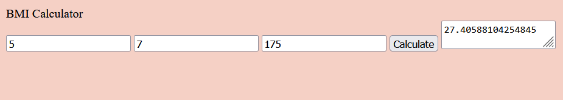

# BMI Calculator

Understanding the metrics of one's own personal health, by the numbers, is a crucial aspect of understanding progress in this regard. This includes weighing yourself on the scale, regulating caloric intake, or even counting your reps during a workout. Numbers matter when trying to lose weight or gain muscle, and one specific metric to keep an eye on is your Body Mass Index, or BMI. It takes into account your height and weight, giving you a number that represents the amount of mass on your body, relative to your height. According to the CDC website on BMI, "A high BMI can indicate high body fatness. BMI screens for weight categories that may lead to health problems, but it does not diagnose the body fatness or health of an individual."

For this purpose, I have developed a relatively simple front-end webpage to host a BMI calculator, utilizing some basic JavaScript logic on the back-end to handle the math. All a user would need to do is enter their height in feet/inches and their weight in lbs. Please take the time to see how this calculation comes together in my script.js file. I have also included a list of resources, both for the code itself and as a source of information pertaining to body mass index. Thank you for reading.

---

### Screenshot of webpage:

---

Follow link https://brutchley9.github.io/bmi-calculator/ to access this website!

Follow link https://github.com/brutchley9/bmi-calculator/ to access GitHub repository for this website (including code).

---

# Resources

<li>https://www.cdc.gov/healthyweight/assessing/bmi/adult_bmi/english_bmi_calculator/bmi_calculator.html</li>

<li>https://simpledev.io/lesson/get-input-value-js/</li>

<li>https://stackoverflow.com/questions/7658176/adding-two-variables-together</li>

<li>https://developer.mozilla.org/en-US/docs/Web/JavaScript/Reference/Global_Objects/parseInt</li>

<li>https://stackoverflow.com/questions/65929647/print-variable-to-text-area-instead-of-console-in-javascript</li>

<li>https://stackoverflow.com/questions/56705177/should-jest-enzyme-be-a-devdependency-or-dependency</li>

<li>https://www.w3schools.com/howto/howto_js_trigger_button_enter.asp</li>

---

#### Developed by Brad Hutchison (2024)